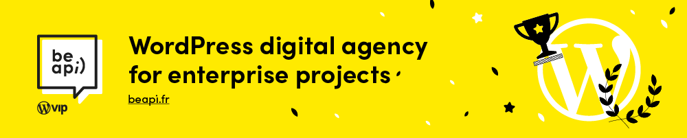

[](https://beapi.fr)

# Blockparty — Accordion

[](https://playground.wordpress.net/?blueprint-url=https://raw.githubusercontent.com/beapi/blockparty-accordion/refs/heads/main/.wordpress-org/blueprints/blueprint.json)

[](https://www.gnu.org/licenses/gpl-2.0)
[](https://wordpress.org/)
[](https://php.net/)

A WordPress plugin that adds accessible accordion blocks to the Gutenberg editor and frontend. Markup uses headings, buttons, and regions with ARIA-appropriate behavior; interactivity is provided by [`@beapi/be-a11y`](https://github.com/BeAPI/be-a11y)’s **Accordion** helper and a small view script on page load.

## Description

Blockparty Accordion is a WordPress plugin that provides a set of nested blocks to build an accordion: a root **Accordion** block contains **Item** blocks; each item is made of a **Summary** (the visible title and button trigger) and a **Panel** (the expandable content region). You can open the first item by default from the parent block, and the **Summary** block can host the **blockparty/icons** block when you need an icon next to the label.

## Features

- **Native Gutenberg blocks**: Accordion, Item, Summary, and Panel blocks, registered from `block.json`
- **Accessible behavior**: Triggers, panels, and focus management through `@beapi/be-a11y` [accessible accordion](https://github.com/BeAPI/be-a11y) (see the view script on the main accordion block)
- **Editor options** (root Accordion): e.g. “Open first item by default”
- **Summary block**: icon support via **blockparty/icons** where applicable
- **Internationalized** with text domain `blockparty-accordion` (e.g. French in `languages/`) and `wp_set_script_translations` for the editor
- **Frontend view script** on the main accordion block for expand/collapse behavior
- **Configurable** via the `beapi_accordion_block_config` filter (see below)

## Requirements

- **WordPress**: 6.2 or higher
- **PHP**: 8.1 or higher
- **PHP extension**: `ext-json`

## Installation

### Via Composer

```bash
composer require beapi/blockparty-accordion
```

### Manual installation

1. Download the latest release or zip from this repository
2. Extract the plugin to `/wp-content/plugins/blockparty-accordion`
3. Activate **Blockparty Accordion** in **Plugins** in the WordPress admin

### Development setup

```bash
git clone https://github.com/BeAPI/blockparty-accordion.git
cd blockparty-accordion

composer install
npm install
npm run build
```

## Usage

1. In the block editor, insert an **Accordion** block (e.g. under the **Widgets** category, search for *Accordion*).
2. Add **Item** blocks inside the accordion. Each item contains a **Summary** and a **Panel**:
   - **Summary** — the clickable title line (supports a blockparty icon in the icon slot where configured).
   - **Panel** — the collapsible content (InnerBlocks as defined by the block).
3. Select the **Accordion** block to toggle **Open first item by default** if you want the first item open on page load.
4. On the frontend, the accordion uses the same structure; behavior is provided by the bundled view script and `@beapi/be-a11y`.

## Filter: `beapi_accordion_block_config`

You can change accordion behavior (single vs multiple open panels, animation, selectors, etc.) from a theme or plugin. Defaults are set in the main plugin file; override them with the filter. See the [be-a11y accessible-accordion example](https://github.com/BeAPI/be-a11y/tree/main/examples/accessible-accordion) for the options supported by the underlying script.

```php
add_filter( 'beapi_accordion_block_config', function ( $config ) {
	$config = [
		'allowMultiple' => true,
		'closedDefault'  => true,
		'forceExpand'   => false,
		'hasAnimation'  => true,
	];

	return $config;
} );
```

## Development

### Project structure

```text
blockparty-accordion/
├── src/                              # Block source (build output in build/)
│   ├── blockparty-accordion/       # Parent accordion (edit, save, view script, styles)
│   ├── blockparty-accordion-item/  # Item container
│   ├── blockparty-accordion-summary/
│   └── blockparty-accordion-panel/
├── build/                            # Compiled block assets
├── languages/                        # .pot, .po, .mo, and Jed .json
├── .wordpress-org/blueprints/        # WordPress Playground blueprint
├── blockparty-accordion.php
├── composer.json
└── package.json
```

### JavaScript (npm)

```bash
npm start              # @wordpress/scripts dev
npm run build
npm run lint:js
npm run lint:css
npm run format
npm run plugin-zip
npm run start:env   # @wordpress/env
npm run stop:env
```

### i18n (optional)

```bash
npm run make-pot    # Regenerate blockparty-accordion.pot
npm run make-json   # Regenerate Jed JSON from .po
```

Regenerate the `.mo` with WP-CLI after editing `.po` files, for example: `wp i18n make-mo languages/`

### PHP (Composer)

```bash
composer cs      # PHPCS
composer cb      # PHPCBF
composer psalm
```

**Coding standards**: WordPress Coding Standards (WPCS) for PHP, `@wordpress/eslint-plugin` for JavaScript, Psalm for static analysis, GrumPHP hooks where configured in `grumphp.yml`.

## Code quality

- **PHP_CodeSniffer** (WPCS)
- **Psalm** for static analysis
- **PHPCS PHPCompatibility** (see `composer.json`)
- **ESLint** and **Stylelint** via `wp-scripts` for front-end code

## Internationalization

- Text domain: `blockparty-accordion`
- Template: `languages/blockparty-accordion.pot`
- Bundled example: `languages/blockparty-accordion-fr_FR.*`

## Contributing

1. Fork the repository
2. Create a branch: `git checkout -b feature/your-feature`
3. Commit with clear messages (e.g. [Conventional Commits](https://www.conventionalcommits.org/))
4. Open a pull request

Ensure code follows WPCS, passes linters, and that string changes are reflected in `languages/` when needed.

## License

This project is released under the **GPL-2.0-or-later** license. See [LICENSE](LICENSE).

## Authors

**Be API Technical team**

- Email: [technical@beapi.fr](mailto:technical@beapi.fr)
- Website: [https://beapi.fr](https://beapi.fr)

## Useful links

- [Block Editor documentation](https://developer.wordpress.org/block-editor/)
- [WAI-ARIA Accordion Pattern](https://www.w3.org/WAI/ARIA/apg/patterns/accordion/) (accessibility background)
- [be-a11y (Be API)](https://github.com/BeAPI/be-a11y)

## Changelog

See [readme.txt](readme.txt) and [CHANGELOG.md](CHANGELOG.md) for the full version history. Recent highlights:

- **1.2.0** — Clearer inserter copy; French and asset refresh; WordPress Playground blueprint; icon package updates; developer tooling and workflow tweaks.
- **1.1.0** — Support for `blockparty/icons`; accordion item icon update; translation fixes.
- **1.0.8** — Option to open the first item by default.
- **1.0.0** — Initial release.

---

Developed with ❤️ by [Be API](https://beapi.fr)
